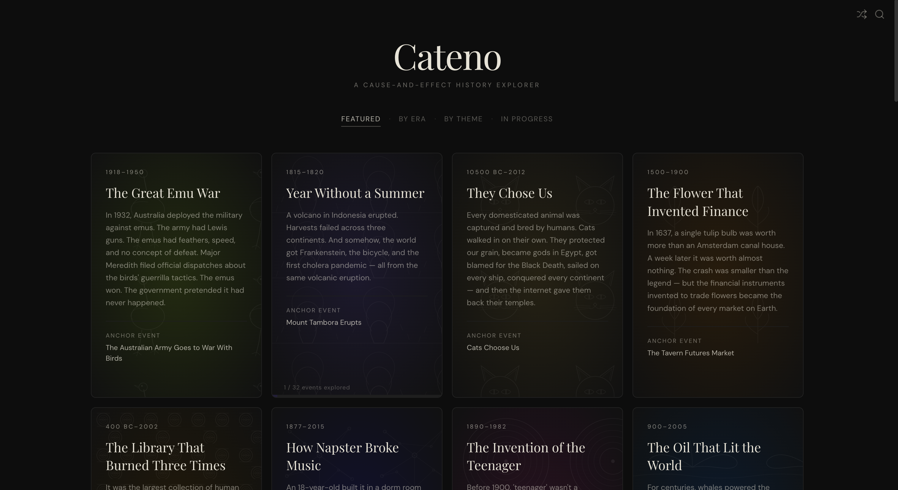
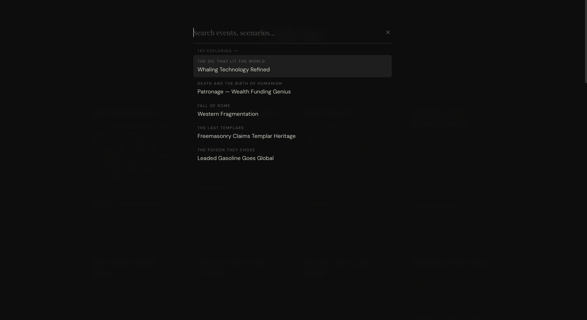
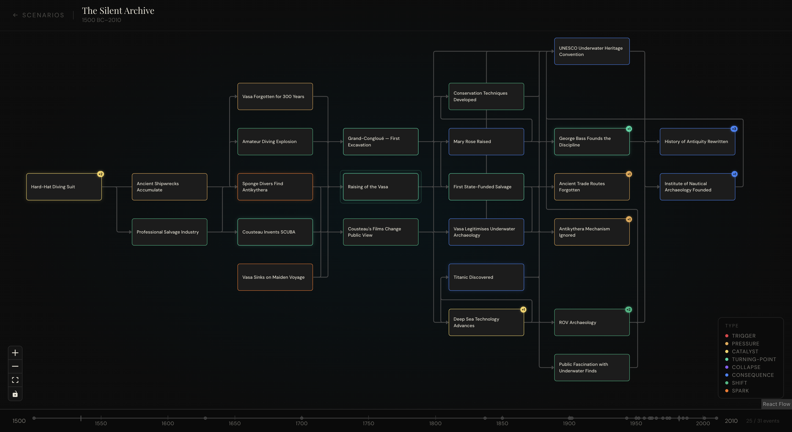
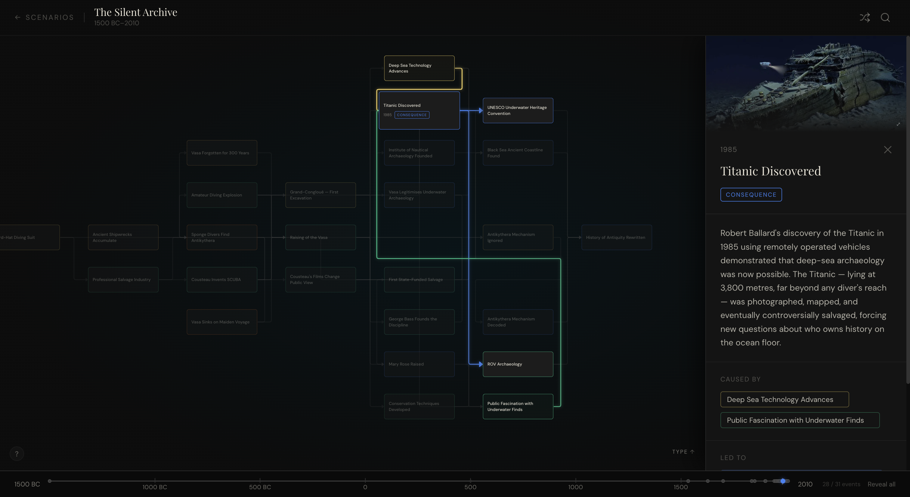
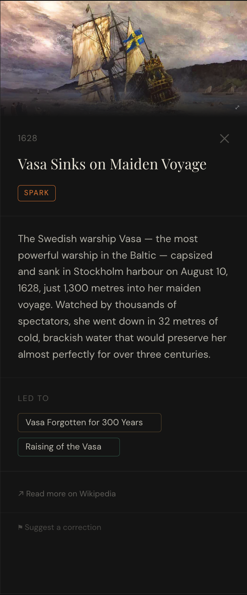

# Cateno

A cause-and-effect history explorer. Pick a scenario, start at the anchor event, and follow the chain — exploring what led there and what came next.

Built with React, TypeScript, React Flow, and Tailwind CSS.

→ [cateno.app](https://cateno.app)

---

## Scenarios

Twenty-eight curated scenarios, each with a number of interconnected events:

- **Fall of Rome** (100-600)
- **French Revolution** (1700-1803)
- **Scientific Revolution** (1200-1760)
- **Year Without a Summer** (1815-1820)
- **World War I** (1871-1933)
- **First Flight** (1485-1960)
- **The Silent Archive** — Age of Underwater Archaeology (1500 BC-2010)
- **The Last Templars** (1096-1500)
- **Mongol Conquests** (1100-1492)
- **The Polynesian Expansion** (1500 BC-1976)
- **The Voyages That Stopped** (960-1500)
- **The Sale That Made America** (1697-1853)
- **The Oil That Lit the World** (900-2005)
- **How Napster Broke Music** (1877-2015)
- **The Flower That Invented Finance** (1500-1900)
- **The Poison They Chose** (1900-2010)
- **The Invention of the Teenager** (1890-1982)
- **Death and the Birth of Humanism** (1100-1520)
- **The Voyage That Connected the World** (1300-1602)
- **How a Patent Lawsuit Built Hollywood** (1891-1930)
- **The Postmaster Who Ran Hollywood** (1921-1968)
- **The Two Films That Ended Good Cinema** (1967-1995)
- **The Arms Race That Nearly Destroyed F1** (1966-1990)
- **How a Used Car Dealer Built a $6 Billion Empire** (1970-2017)
- **The Weekend That Changed Everything** (1950-2022)
- **The Great Emu War** (1918-1950)
- **They Chose Us** — The History of Cats (10500 BC–2012)
- **The Library That Burned Three Times** (400 BC-2002)
- **The Drink That Invented Conversation"** (1450-2004)

---

## Screenshots











---

## How it works

Each scenario is a directed graph of historical events stored as a JSON file. Every node has:

- A title, year, and one-paragraph summary
- A keyword type (`trigger`, `pressure`, `catalyst`, `turning-point`, `collapse`, `consequence`, `shift`, `spark`)
- Arrays of cause IDs and effect IDs linking it to other nodes
- Optional Wikipedia article name and image URL
- Optional related scenarios

The graph loads with 6 seed nodes visible. Clicking any node reveals its connected events and opens a detail panel. The `+N` badge on each node shows how many hidden connections remain.

Nodes you haven't opened yet have a bright border — once visited, they settle into a neutral state. Your exploration progress is saved locally so you pick up where you left off.

---

## Features

- **Catalogue views** — browse scenarios by era, theme, or progress (Featured / By era / By theme / In progress)
- **Progressive exploration** — start at one pivotal moment, reveal causes and effects one click at a time
- **Detail panel** — each node shows a summary, year, keyword type, Wikipedia image, and navigation chips to connected events
- **Cross-scenario links** — some nodes connect directly to related events in other scenarios
- **Search** — `Cmd+K` / `Ctrl+K` searches across all scenarios and nodes
- **Surprise me** — random entry point drops you into an unexpected node from a random scenario
- **Shareable node URLs** — every focused node has its own URL (e.g. `cateno.app/wwi/assassination-franz-ferdinand`)
- **Timeline bar** — shows the full temporal range of the scenario with event dots
- **Onboarding hint** — a dismissible first-visit guide explains the core interactions; re-accessible any time via the ? button in the graph view
- **Reveal all / Reset** — explore everything at once or start over
- **Progress tracking** — landing page shows how many events you've explored per scenario
- **Suggest a correction** — flag factual errors or missing connections directly from any node
- **Mobile-first** — full bottom sheet detail panel, tap-friendly node targets

---

## Tech stack

| Layer      | Choice                            |
| ---------- | --------------------------------- |
| Framework  | React + Vite + TypeScript         |
| Graph      | React Flow                        |
| Animations | Framer Motion                     |
| Styling    | Tailwind CSS                      |
| Data       | Static JSON — no backend          |
| Analytics  | Vercel Analytics + Speed Insights |
| Hosting    | Vercel                            |

---

## Adding a scenario

1. Create a JSON file in `src/data/` following the `CatenoNode` schema
2. Add it to the `SCENARIOS` array in `src/data/scenarios.ts`
3. Add a background colour and SVG pattern in `src/theme.tsx`
   Each node must have:

- A unique `id` (kebab-case)
- `causeIds` and `effectIds` that reference other IDs in the same file
- Exactly one node with `isAnchor: true`
- Six nodes with `isSeed: true` (the anchor + 2–3 causes + 2–3 effects)
  Optional fields:

- `wiki` — Wikipedia article name, used to build a "Read more" link
- `imageUrl` — direct image URL shown as the detail panel header
- `relatedScenario` — links this node to a node in another scenario

---

## Running locally

```bash
npm install
npm run dev
```

---

## License

MIT
