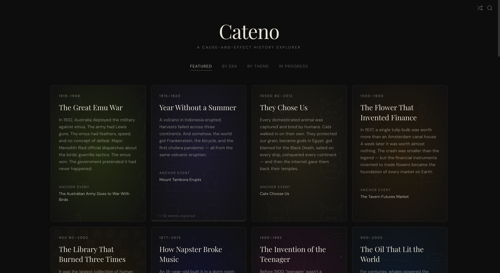
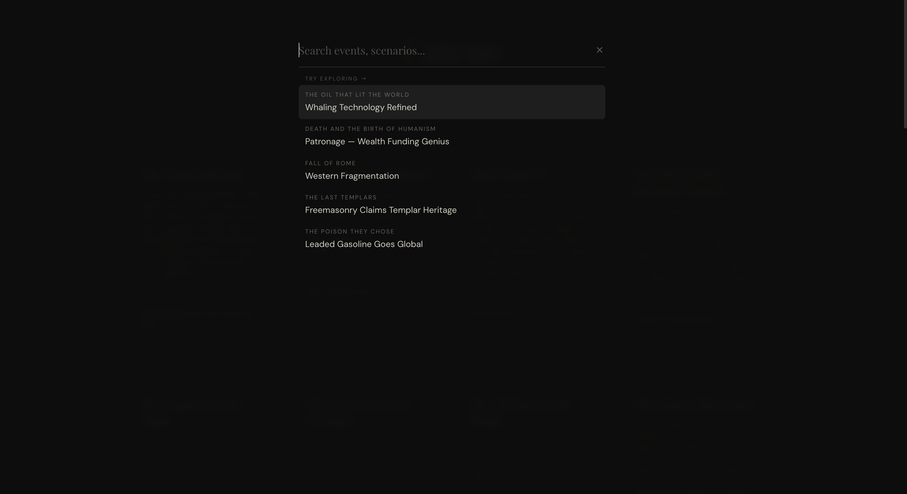
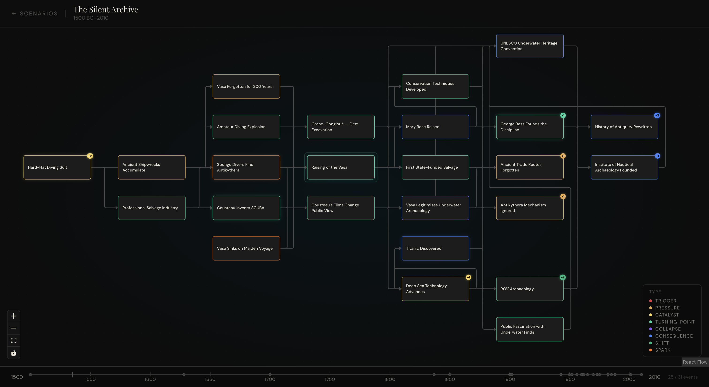
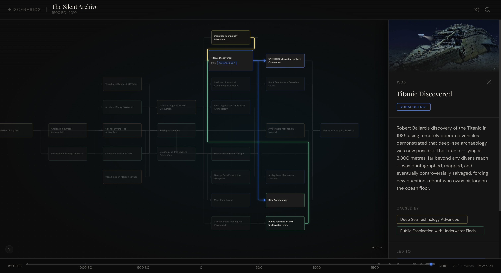
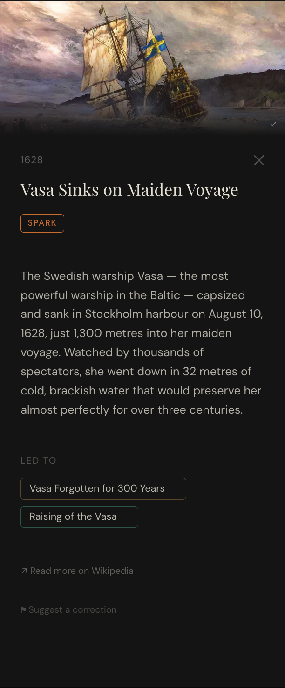

# Cateno

A cause-and-effect history explorer. Pick a scenario, begin at its anchor event, and follow the chain to explore what led to it and what happened next.

Built with React, TypeScript, React Flow, and Tailwind CSS.

→ https://cateno.app

---

## Scenarios

Forty-three curated scenarios, each consisting of interconnected historical events:

- **Fall of Rome** (100–600)
- **French Revolution** (1700–1803)
- **Scientific Revolution** (1200–1760)
- **Year Without a Summer** (1815–1820)
- **World War I** (1871–1933)
- **First Flight** (500 BC–1961)
- **The Silent Archive** — Age of Underwater Archaeology (1500 BC–2010)
- **The Last Templars** (1099–1907)
- **Mongol Conquests** (750–1492)
- **The Polynesian Expansion** (1500 BC–1976)
- **The Voyages That Stopped** (960–1500)
- **The Sale That Made America** (1697–1853)
- **The Oil That Lit the World** (900–2005)
- **How Napster Broke Music** (1877–2015)
- **The Flower That Invented Finance** (1500–1954)
- **The Poison They Chose** (1900–2023)
- **The Invention of the Teenager** (1890–1982)
- **Death and the Birth of Humanism** (1100–1520)
- **The Voyage That Connected the World** (1300–1602)
- **How a Patent Lawsuit Built Hollywood** (1891–1930)
- **The Postmaster Who Ran Hollywood** (1921–1968)
- **The Two Films That Ended Good Cinema** (1967–1995)
- **The Arms Race That Nearly Destroyed F1** (1966–1990)
- **How a Used Car Dealer Built a $6 Billion Empire** (1970–2017)
- **The Weekend That Changed Everything** (1950–2022)
- **The Great Emu War** (1900–2000)
- **They Chose Us** — The History of Cats (10500 BC–2012)
- **The Library That Burned Three Times** (400 BC–2002)
- **The Drink That Invented Conversation** (1400–2004)
- **The City That Made the Slavic World** (482–1991)
- **The Most Cancelled Man in Music History** (1990–2026)
- **Daylight Robbery** (1690–1900)
- **The Policy Nobody Can Kill** (1700–2026)
- **Three Hours, $15, and 170 Years** (1200 BC–2020)
- **The House of Madness** (1200–2000)
- **The Map That Saved a Million Lives** (1800–1997)
- **The Drug That Built an Empire and Destroyed Another** (1700–1997)
- **How the Rich Learned to Worship the Sun** (1700–1975)
- **The Ditch That Ran the World** (600 BC–1967)
- **The Beach Was Not Always a Holiday** (1700–1975)
- **The Death That Produced More Philosophy Than Any Life** (450 BC–1929)
- **The Blind Poet Who Never Existed** (1200 BC–1960)
- **The Criminals Europe Created** (1243–2008)

---

## Screenshots











---

## How it works

Each scenario is a directed graph of historical events stored as a JSON file. Every node has:

- A title, year, and one-paragraph summary
- An event type (`trigger`, `pressure`, `catalyst`, `turning-point`, `collapse`, `consequence`, `shift`, or `spark`)
- Arrays of cause and effect IDs that link it to other events
- Optional Wikipedia article name and image URL
- Optional related scenarios

The graph loads with a small set of seed nodes visible. Clicking any node reveals its connected events and opens a detail panel. The `+N` badge on each node shows how many hidden connections remain.

Your exploration progress is saved locally so you can pick up where you left off.

---

## Features

- **Catalogue views** — browse scenarios by era, theme, or progress (Featured / By era / By theme / In progress)
- **Progressive exploration** — start at one pivotal moment and reveal causes and effects one click at a time
- **Detail panel** — each node shows a summary, year, event type, Wikipedia image, and navigation chips to connected events
- **Cross-scenario links** — some nodes connect directly to related events in other scenarios
- **Search** — press `Cmd+K` or `Ctrl+K` to search across all scenarios and nodes
- **Surprise me** — jump to an unexpected node from a random scenario
- **Shareable node URLs** — every focused node has its own URL (e.g. `cateno.app/wwi/assassination-franz-ferdinand`)
- **Timeline bar** — shows the full temporal range of the scenario with event dots
- **Onboarding hint** — a dismissible first-visit guide to the core interactions, available again at any time from the `?` button in the graph view
- **Reveal all / Reset** — reveal every node at once or start over
- **Progress tracking** — the landing page shows how many events you've explored per scenario
- **Suggest a correction** — flag factual errors or missing connections directly from any node
- **Mobile-friendly** — full bottom-sheet detail panel and tap-friendly node targets

---

## Tech stack

| Layer | Choice |
|-------|--------|
| Framework | React + Vite + TypeScript |
| Graph | React Flow |
| Animations | Framer Motion |
| Styling | Tailwind CSS |
| Data | Static JSON — no backend |
| Analytics | Vercel Analytics + Speed Insights |
| Hosting | Vercel |

---

## Adding a scenario

1. Create a JSON file in `src/data/` following the `CatenoNode` schema.
2. Add its metadata to the `SCENARIO_META` array in `src/data/scenarios.ts`.
3. Add a background colour and SVG pattern in `src/theme.tsx`.

Each node must have:

- A unique kebab-case `id`
- `causeIds` and `effectIds` that reference other IDs in the same file
- Exactly one node with `isAnchor: true`
- Six or seven nodes with `isSeed: true`

Optional fields:

- `wiki` — Wikipedia article name used to build a "Read more" link
- `imageUrl` — direct image URL shown as the detail panel header
- `relatedScenario` — links this node to a node in another scenario

---

## Running locally

```bash
npm install
npm run dev
```

---

## License

MIT
